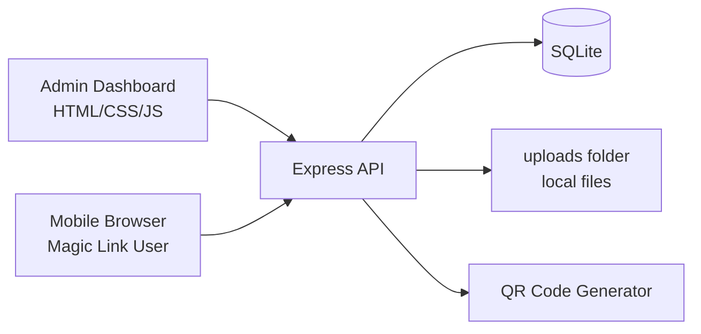
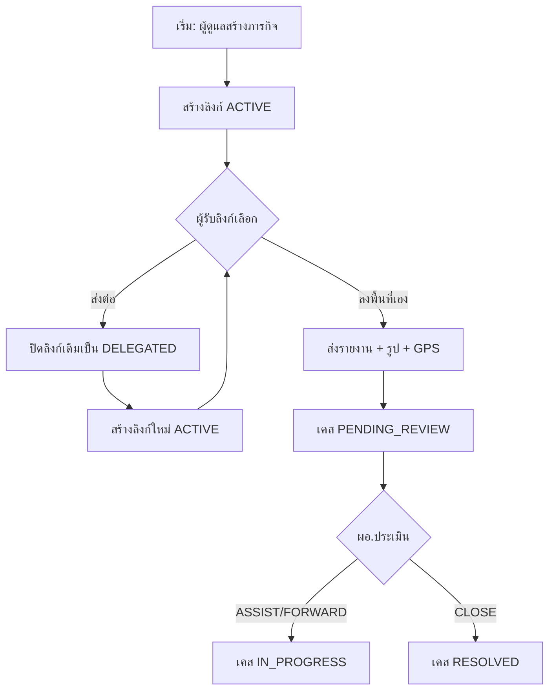
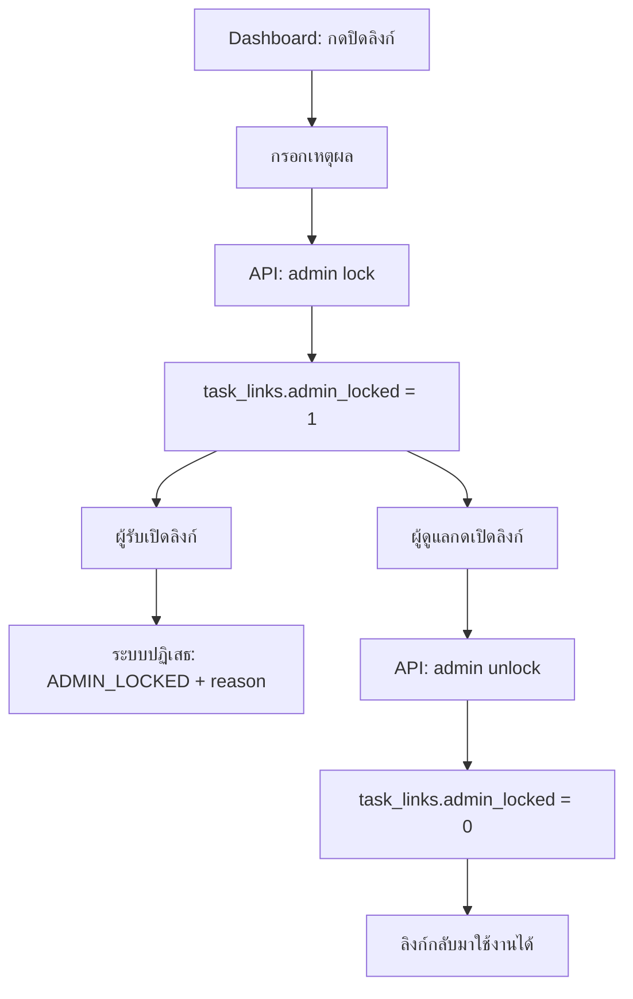
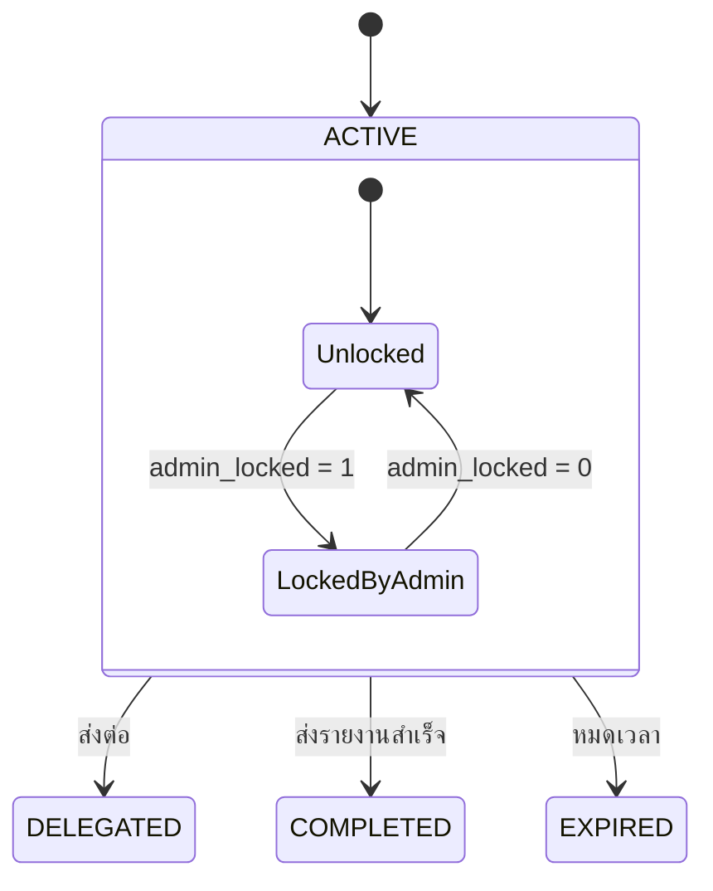

# STS System Spec, Workflow, and Current Status

> เอกสารสรุปภาพรวมระบบ STS (Prototype/PoC) ว่า "ระบบนี้ทำอะไร", "ทำงานอย่างไร", และ "ตอนนี้ไปถึงไหนแล้ว"

---

## 1) System Purpose (ระบบนี้เอาไว้ทำอะไร)

STS (Student Tracking System) ใช้สำหรับติดตามเคสเด็กขาดเรียน โดยออกแบบให้ใช้งานง่ายผ่าน **Magic Link** บนมือถือ ไม่ต้องสมัครบัญชี ไม่ต้องติดตั้งแอป

จุดเด่น:
- ส่งต่อภารกิจเป็นทอดๆ ได้ (Delegation Chain)
- เก็บประวัติว่าใครรับงาน ใครส่งต่อ ใครเป็นคนปิดงานจริง
- รองรับหลักฐานลงพื้นที่: พิกัด + รูปภาพ + รายงาน
- ผอ./ครูติดตามทั้งหมดได้จาก Dashboard

---

## 2) Actors (ผู้ใช้งาน)

- **ผู้ดูแล/ผอ./ครูต้นทาง**
  - สร้างเคสและภารกิจ
  - ดูสถานะ, timeline, audit trail
  - ปิด/เปิดลิงก์ได้ทันทีพร้อมระบุเหตุผล
- **ผู้รับงานปลายทาง (เช่น ผู้ใหญ่บ้าน/อสม.)**
  - เปิดลิงก์จาก LINE
  - เลือกลงพื้นที่เอง หรือส่งต่อให้คนอื่น
  - ส่งรายงานภาคสนาม

---

## 3) Scope (ขอบเขต Prototype ปัจจุบัน)

### In Scope (ทำแล้ว)
- Dashboard + Summary stats
- สร้างภารกิจ + ออก Magic Link + QR
- ส่งต่อภารกิจหลายทอด (depth limit)
- รายงานภาคสนาม + แนบรูป + GPS
- Audit trail ดู chain ได้
- แชร์ผ่าน LINE + copy link
- ผู้ดูแลปิด/เปิดลิงก์พร้อมเหตุผล
- Dashboard filter ตามวันที่ / โรงเรียน / สถานะลิงก์
- โหมดผู้บริหาร (แยกมุมมองเคสที่ต้องดำเนินการ)
- Mobile responsive

### Out of Scope (ยังไม่ทำใน PoC)
- Login/Role management จริง
- Realtime push (WebSocket/SSE)
- Cloud storage สำหรับรูป
- LINE Bot / Messaging API / LIFF
- Rate limiting / WAF / production hardening เต็มรูปแบบ

---

## 4) High-Level Architecture

---

## 5) Core Flow (การทำงานหลัก)

### Flow A: สร้างงานครั้งแรก
1. ผู้ดูแลกด "สร้างภารกิจ"
2. ระบบสร้าง `case + task + task_link (ACTIVE)`
3. คืนค่า `magic_link` และ `qr_code`
4. ผู้ดูแล copy/share ผ่าน LINE

### Flow B: ผู้รับงานเลือก "ลงพื้นที่เอง"
1. เปิดลิงก์ `/task/:token`
2. ไปหน้ารายงาน `/task/:token/report`
3. กรอกข้อมูล + แนบรูป + GPS
4. ระบบบันทึก submission
5. อัปเดตสถานะลิงก์เป็น `COMPLETED`, เคสเป็น `PENDING_REVIEW`

### Flow C: ผู้รับงานเลือก "ส่งต่อ"
1. เปิดลิงก์เดิม (ต้อง ACTIVE)
2. กรอกชื่อผู้รับงานใหม่
3. ระบบเปลี่ยนลิงก์เดิมเป็น `DELEGATED`
4. ระบบสร้างลิงก์ใหม่ `ACTIVE` พร้อม `parent_link_id`
5. ส่งลิงก์ใหม่ต่อไป

### Flow D: ผู้ดูแลปิด/เปิดลิงก์
1. ไปที่ Dashboard > คอลัมน์จัดการลิงก์
2. กด `ปิดลิงก์` และกรอกเหตุผล (required)
3. ลิงก์ถูก block ทันที (แม้ยังไม่หมดเวลา)
4. หากต้องการ กด `เปิดลิงก์` เพื่อใช้งานต่อ

### Flow E: ผอ./ผู้ดูแลประเมินผลหลังลงพื้นที่
1. เคสที่รายงานเสร็จจะขึ้นสถานะ `PENDING_REVIEW`
2. ผอ.เข้า Task Detail แล้วเลือกผลประเมิน
3. เลือกได้ 3 ทาง: `ASSIST`, `FORWARD`, `CLOSE`
4. บันทึกหมายเหตุ + ผู้ประเมิน + เวลาประเมิน
5. ถ้าเลือก `CLOSE` เคสจะเป็น `RESOLVED`, หากเลือกอื่นจะกลับไป `IN_PROGRESS`

---

## 6) Flow Diagram (End-to-End)

---

## 7) Admin Lock Flow Diagram

---

## 8) State Model (Link Status)

หมายเหตุ:
- `status` (ACTIVE/DELEGATED/COMPLETED/EXPIRED) คือ lifecycle หลักของลิงก์
- `admin_locked` เป็น gate เพิ่มเติมที่ block การใช้งาน แม้ status ยังเป็น ACTIVE

Case status lifecycle:
- `OPEN` -> `IN_PROGRESS` -> `PENDING_REVIEW` -> (`IN_PROGRESS` หรือ `RESOLVED`)

---

## 9) API Summary (สำคัญ)

- `POST /api/tasks` — สร้างเคส + task + ลิงก์แรก
- `GET /api/tasks/:token` — เปิดดูงานจาก token (validate หมดอายุ/ถูกปิด/ถูกใช้แล้ว)
- `POST /api/tasks/:token/delegate` — ส่งต่อภารกิจ
- `POST /api/tasks/:token/submit` — ส่งรายงานภาคสนาม
- `POST /api/cases/:caseId/review` — ผอ.บันทึกผลประเมิน (ASSIST/FORWARD/CLOSE)
- `GET /api/cases/:caseId/reviews` — ดึงประวัติการประเมินเคส
- `GET /api/tasks/:taskId/chain` — ดู delegation chain
- `GET /api/cases` — ข้อมูล dashboard รวม active link
- `GET /api/stats` — ตัวเลข summary
- `POST /api/task-links/:linkId/admin-lock` — ผู้ดูแล lock/unlock ลิงก์

---

## 10) Data Model Snapshot

- `cases` — ข้อมูลเคสเด็ก
- `tasks` — ภารกิจหลักของเคส
- `task_links` — ลิงก์แต่ละทอด (self-reference ผ่าน `parent_link_id`)
  - ฟิลด์สำคัญเพิ่มล่าสุด: `admin_locked`, `admin_lock_reason`, `admin_lock_at`
- `task_submissions` — รายงานที่ส่งจากลิงก์ปลายทาง
- `case_reviews` — ประวัติผลประเมินของผอ./ผู้ดูแลต่อแต่ละเคส

---

## 11) Current Project Status (ถึงไหนแล้ว)

สถานะรวม: **Prototype หลักเสร็จใช้งานได้ครบ flow**

- ✅ สร้างภารกิจ, แชร์ลิงก์, QR
- ✅ ส่งต่อหลายทอด
- ✅ รายงานลงพื้นที่ + รูป + GPS
- ✅ Dashboard + Stats + Audit trail
- ✅ รองรับมือถือ
- ✅ แชร์ผ่าน LINE (เว็บแชร์ + mobile flow)
- ✅ ผู้ดูแลปิด/เปิดลิงก์ + เหตุผล
- ✅ ผอ./ผู้ดูแลประเมินผลหลังลงพื้นที่ (ASSIST/FORWARD/CLOSE)
- ✅ Dashboard filter ขั้นสูง (วันที่ / โรงเรียน / สถานะลิงก์ / โหมดผู้บริหาร)
- ✅ ทดสอบ end-to-end หลักครบ

---

## 12) Suggested Next Steps (ถ้าจะต่อเป็น Production)

1. เพิ่ม Auth + RBAC (admin/supervisor/field-user)
2. บันทึก action log ผู้ดูแล (ใคร lock/unlock เมื่อไหร่)
3. Cloud storage + image optimization pipeline
4. Realtime dashboard updates
5. LINE Messaging API/LIFF integration
6. Deploy + HTTPS + domain + monitoring

