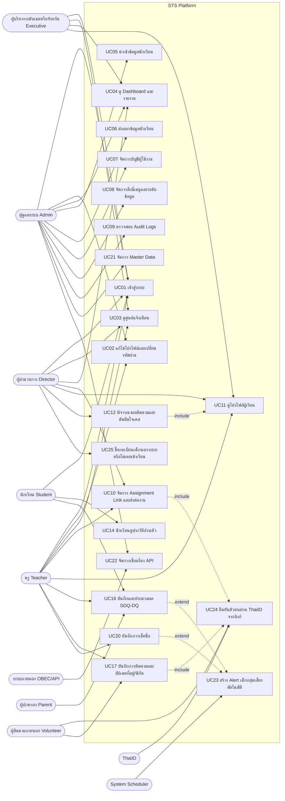
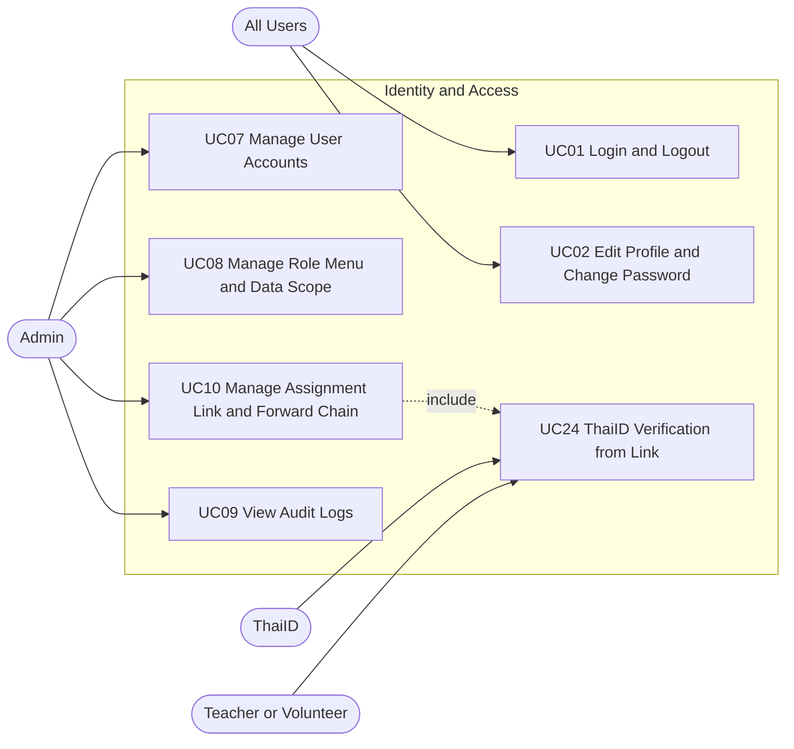
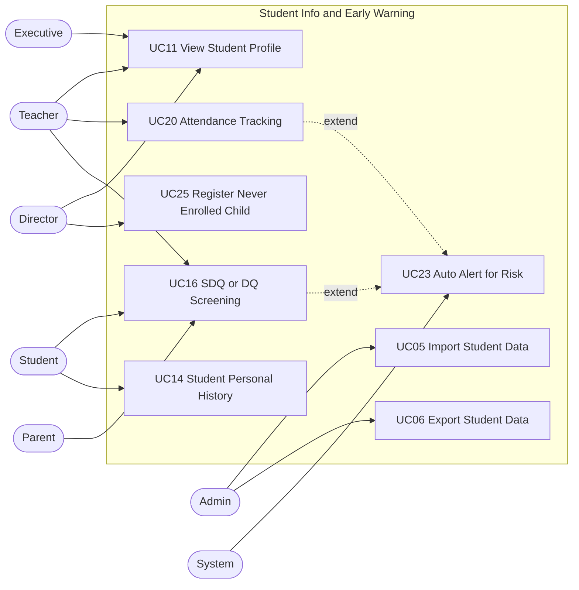
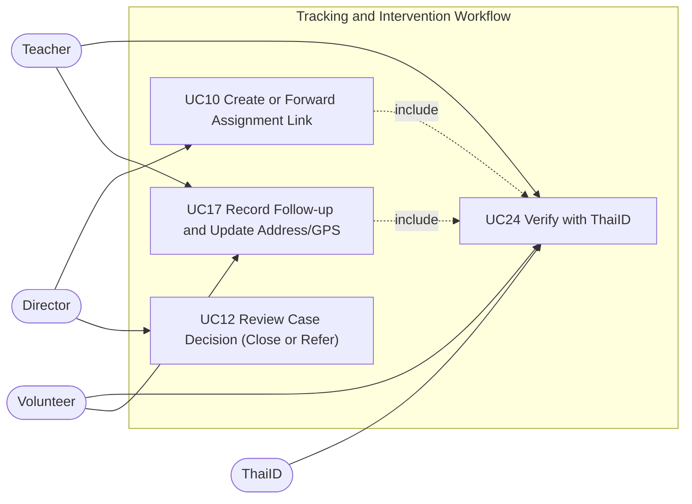
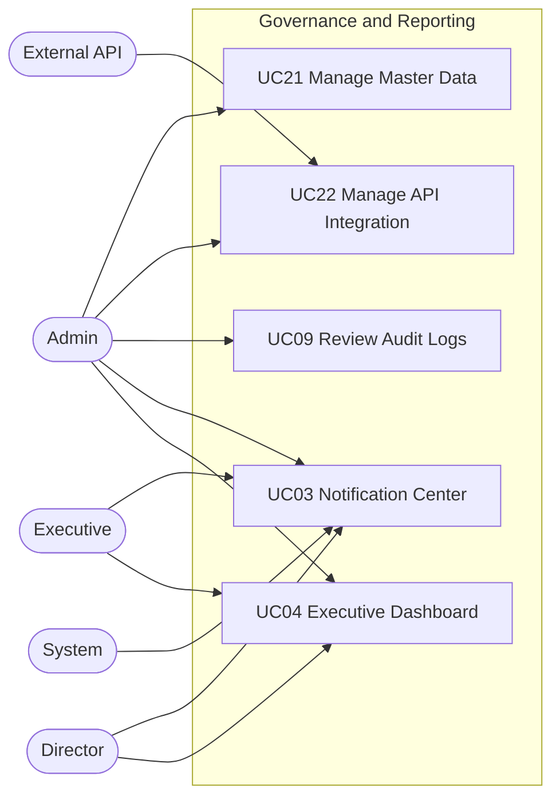
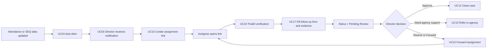
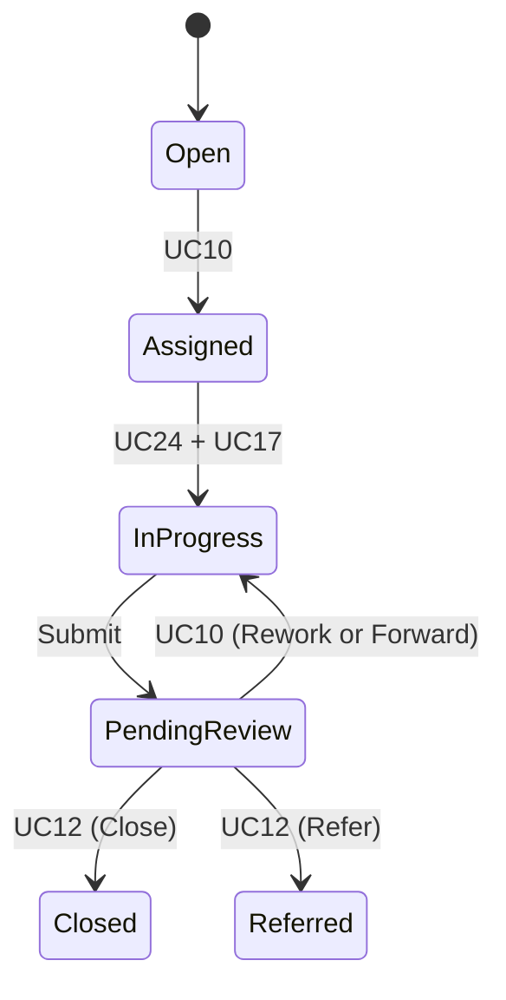

# STS Use Case Baseline v4.1 (Consolidated)

อ้างอิงจากเอกสารต่อไปนี้
- `Software Requirements Specification (SRS).docx` (v3.0 วันที่ 12 มีนาคม 2569)
- `Usecase Description V2.docx` (UC01-UC20)
- `SBP_RTM_UML.xlsx` (ชีต `RTMT` เป็นแหล่ง traceability หลักของ STS)
- `main_srs.md` (ทิศทางระบบ/วิสัยทัศน์)

เอกสารนี้ปรับเป็น baseline แบบ consolidated เพื่อรวม use case ที่ intent ซ้อนกัน และลดความซ้ำใน RTM/UAT

## 0) หลักการ Consolidation

1. ใช้รหัส UC ตัวแรกเป็น `Canonical UC ID`  
2. รหัสเดิมที่ถูกรวมให้เป็น `Deprecated Alias` ชั่วคราว (เพื่อ migrate RTM/Test Case)  
3. หลังแก้ RTM เสร็จ ให้ยุบ alias ออกจากแผนผังหลัก

ตาราง Consolidation หลักรอบนี้

| Deprecated Alias | Canonical UC | แนวทางรวม |
|---|---|---|
| UC13 | UC12 | รวม action ตัดสินใจเคส (ปิดเคส/ส่งต่อหน่วยงาน) |
| UC15 | UC14 | รวมมุมมองนักเรียนเป็นโปรไฟล์ส่วนตัวเดียว (การศึกษา/สุขภาพ/สถานะติดตาม) |
| UC18 | UC17 | รวมเป็น subflow ในการติดตามภาคสนาม (อัปเดตที่อยู่/พิกัด) |
| UC19 | UC10 | รวมการส่งต่องานเป็น action ใน lifecycle ของ Assignment Link |

## 1) System-Level Use Case (Big Picture)

## 2) Feature-Level Use Case

### 2.1 Identity, Access, and Security

### 2.2 Student Information, Attendance, and Risk Screening

### 2.3 Tracking, Intervention, and Case Closure

### 2.4 Governance, Integration, Notification, and Reporting

## 3) End-to-End Flow (Alert -> Assign -> Follow-up -> Review)

## 4) Use Case Catalog (Canonical หลัง Consolidation)

| Use Case | ชื่อ Use Case | Actor หลัก | FR/NFR ที่ครอบคลุม |
|---|---|---|---|
| UC01 | เข้าสู่ระบบ (Login) | All Users | FR-AUTH-01, FR-LOG-01, NFR-SEC-04 |
| UC02 | แก้ไขข้อมูลส่วนตัว/เปลี่ยนรหัสผ่าน | All Users | FR-AUTH-05, NFR-SEC-04 |
| UC03 | ดูรายการแจ้งเตือน | All Users | FR-NOT-01, FR-TRK-01 |
| UC04 | ดูรายงานภาพรวม | Admin, Executive, Director | FR-RPT-01 |
| UC05 | นำเข้าข้อมูลนักเรียน | Admin | FR-STD-04 |
| UC06 | ส่งออกข้อมูลนักเรียน | Admin | FR-STD-04 |
| UC07 | จัดการบัญชีผู้ใช้งาน | Admin | FR-AUTH-02, FR-LOG-03 |
| UC08 | จัดการสิทธิ์เมนู/บทบาท/ระดับข้อมูล | Admin | FR-AUTH-03, FR-AUTH-04, NFR-SEC-01 |
| UC09 | ตรวจสอบประวัติระบบ (Audit Logs) | Admin | FR-LOG-01, FR-LOG-02, FR-LOG-03 |
| UC10 | จัดการลิงก์มอบหมายงานและส่งต่องาน | Director, Teacher, Admin | FR-AUTH-06, FR-TRK-02 |
| UC11 | ดูโปรไฟล์ผู้เรียน | Executive, Director, Teacher | FR-STD-01, FR-STD-02 |
| UC12 | พิจารณาผลติดตามและตัดสินใจเคส (ปิดเคส/ส่งต่อหน่วยงาน) | Director | FR-TRK-05, FR-TRK-06 |
| UC14 | นักเรียนดูประวัติส่วนตัว (การศึกษา/สุขภาพ/สถานะติดตาม) | Student | FR-STD-07 |
| UC16 | บันทึกแบบประเมิน SDQ/DQ | Teacher, Student, Parent | FR-STD-06 |
| UC17 | บันทึกการติดตามภาคสนามและอัปเดตที่อยู่/พิกัด | Teacher, Volunteer | FR-TRK-03, FR-TRK-04, FR-STD-03 |
| UC20 | บันทึกการเช็คชื่อ | Teacher | FR-STD-05 |
| UC21 | จัดการข้อมูลพื้นฐาน (Master Data) | Admin | FR-MST-01, FR-MST-02, FR-MST-03 |
| UC22 | จัดการเชื่อมโยงข้อมูลผ่าน API | Admin, System | FR-INT-01, FR-INT-02, FR-INT-03, FR-INT-04 |
| UC23 | สร้าง Alert อัตโนมัติ | System | FR-TRK-01 |
| UC24 | ยืนยันตัวตนผ่าน ThaiID จาก Assignment Link | Teacher, Volunteer | FR-AUTH-07 |
| UC25 | ขึ้นทะเบียนเด็กไม่เคยเข้าเรียน/นอกระบบ | Director, Teacher | ส่วนขยายจาก `main_srs.md` (ควรเพิ่มเป็น FR ใหม่ใน SRS) |

## 5) Deprecated Alias Mapping (สำหรับแก้ Usecase Description และ RTM)

| Deprecated UC | Canonical UC | การ migrate เนื้อหา Use Case Description |
|---|---|---|
| UC13 ส่งต่อเคสไปยังหน่วยงาน | UC12 | ย้าย Normal Flow ของ "ส่งต่อไปยังหน่วยงาน" เป็น Alternate Flow/Decision branch ของ UC12 |
| UC15 ดูข้อมูลสุขภาพของตนเอง | UC14 | ย้ายเนื้อหา "ข้อมูลสุขภาพ/สถานะติดตาม" ไปเป็น tab/section ใน UC14 |
| UC18 แก้ไขที่อยู่ปัจจุบัน | UC17 | ย้ายขั้นตอนแก้ที่อยู่และ GPS เป็น include/subflow ใน UC17 |
| UC19 มอบหมายงานต่อ | UC10 | ย้าย flow ส่งต่องานและ chain of custody ไปเป็น Alternate Flow ของ UC10 |

## 6) Traceability Alignment Notes (RTM)

1. ระยะเปลี่ยนผ่านให้เก็บทั้ง `Deprecated UC` และ `Canonical UC` ใน RTM ชั่วคราว 1 รอบรีวิว  
2. จากนั้น migrate ให้ FR ผูกกับ Canonical UC เท่านั้น
3. mapping FR ที่ควรอัปเดตทันที
- `FR-TRK-05`, `FR-TRK-06` -> `UC12`
- `FR-STD-07` -> `UC14`
- `FR-TRK-03`, `FR-TRK-04`, `FR-STD-03` -> `UC17`
- `FR-AUTH-06`, `FR-TRK-02` -> `UC10`
4. mismatch เดิมใน RTM ที่ควรแก้พร้อมกัน
- `FR-AUTH-02/03/04` ไม่ควรชี้ `UC06` เพราะ `UC06` คือ Export Student Data

## 7) สรุปการใช้งานเอกสารฉบับนี้

1. ใช้ภาพในหัวข้อ 1 สำหรับสื่อสาร stakeholder ระดับภาพใหญ่  
2. ใช้หัวข้อ 2-3 สำหรับทำ sequence/activity และออกแบบหน้าจอ  
3. ใช้หัวข้อ 4 เป็น baseline เชื่อม `FR/NFR -> UC -> Test Case (SIT/UAT)`  
4. ใช้หัวข้อ 5-6 เป็น checklist migration สำหรับ `Usecase Description` และ `RTM`
